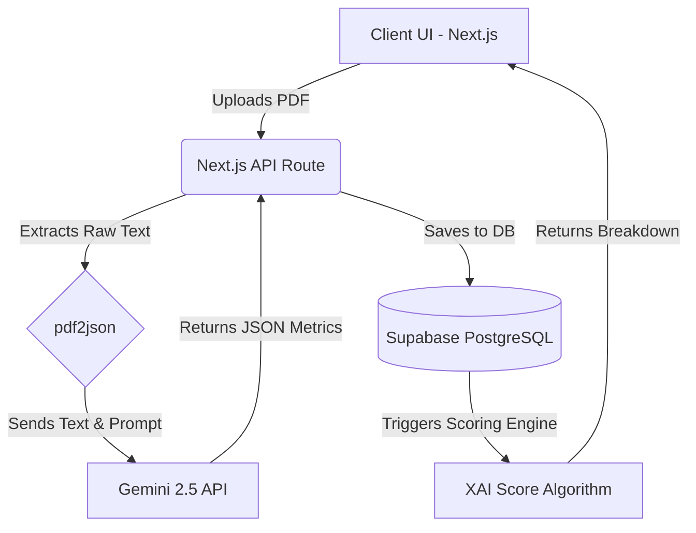

# 🚀 InvisCred: AI-Powered MSME Underwriting

 <!-- Replace with actual screenshot later -->

**InvisCred** is a next-generation alternative credit scoring platform designed to bring financial inclusion to MSMEs, retail vendors, and gig workers. By moving beyond traditional CIBIL scores, InvisCred leverages **Generative AI (Gemini 2.5 Flash)** to semantically analyze raw banking data, generating highly accurate, auditable, and fair credit evaluations.

🌐 **Live Demo:** [https://msme-lender-ui.vercel.app](https://msme-lender-ui.vercel.app)

---

## 📖 The Problem
Millions of micro-businesses and gig workers in emerging markets are "credit invisible." Traditional banks rely on rigid CIBIL scores and formal business registrations (GST), completely locking out informal vendors who have healthy cash flows but lack standard documentation. 

## 💡 The Solution
InvisCred introduces a **Context-Aware Underwriting Engine**. Instead of dumb regex parsers, InvisCred uses Google's Gemini API to read raw bank statements like a human Senior Underwriter. It can differentiate between a student's personal Swiggy orders and a Kirana store's wholesale vendor payouts, generating a dynamic **InvisCred Score (300-850)**.

### ✨ Key Features
- **🧠 GenAI Document Parsing:** Upload raw PDF bank statements. The backend uses `pdf2json` to extract raw text, which is securely analyzed by **Gemini 2.5 Flash** to extract 6 key commercial metrics.
- **⚡ Simulated Account Aggregator:** Simulates direct bank connections via the RBI Account Aggregator framework for instant metric syncs.
- **📊 Explainable AI (XAI) Dashboard:** Provides total transparency. Every credit score is broken down into exactly *why* points were added or deducted (e.g., "+60 High UPI Inflows", "-15 High Variance in Utility Payments").
- **🔒 Supabase Backend:** Secure, real-time database managing applicant profiles, financial metrics, and historical credit scores.

---

## 🏗️ Architecture



---

## 🛠️ Tech Stack
* **Frontend:** Next.js 14 (App Router), React, Tailwind CSS, Lucide Icons
* **Backend:** Next.js Serverless Edge API Routes
* **AI Engine:** `@google/genai` (Gemini 2.5 Flash)
* **Database & Auth:** Supabase
* **Deployment:** Vercel

---

## 💻 Running Locally

1. **Clone the repository:**
   ```bash
   git clone https://github.com/Guru-coder-09/InvisCred.git
   cd InvisCred
   ```

2. **Install dependencies:**
   ```bash
   npm install
   ```

3. **Set up Environment Variables:**
   Create a `.env.local` file in the root directory and add your keys:
   ```env
   NEXT_PUBLIC_SUPABASE_URL=your_supabase_url
   NEXT_PUBLIC_SUPABASE_ANON_KEY=your_anon_key
   SUPABASE_SERVICE_ROLE_KEY=your_service_role_key
   GEMINI_API_KEY=your_gemini_api_key
   ```

4. **Run the development server:**
   ```bash
   npm run dev
   ```
   Open [http://localhost:3000](http://localhost:3000) in your browser.

---

## 📜 License
This project is open-source and available under the [MIT License](LICENSE).
